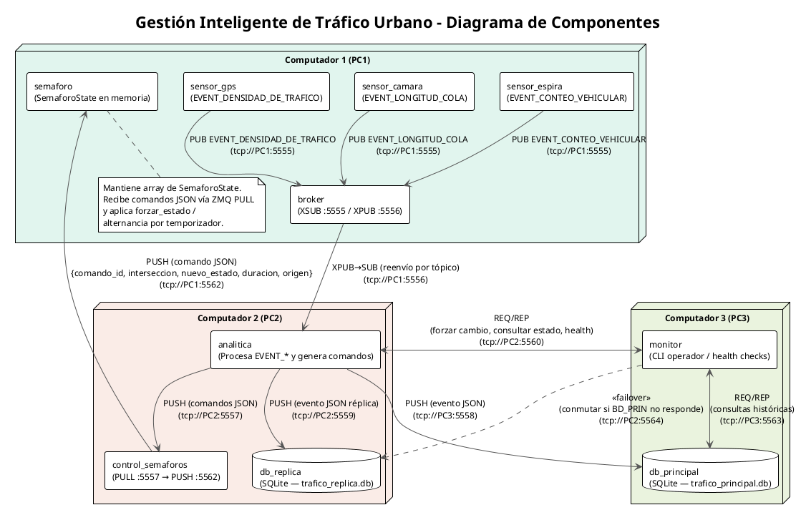

## Diagrama de Componentes

```plantuml
@startuml diagrama_componentes
!theme plain
skinparam componentStyle rectangle
skinparam defaultFontSize 12
skinparam ArrowColor #555555
skinparam rectangleBorderColor #888888

title Gestión Inteligente de Tráfico Urbano - Diagrama de Componentes

node "Computador 1 (PC1)" as PC1 #E1F5EE {
  component "sensor_espira\n(EVENT_CONTEO_VEHICULAR)" as ESP
  component "sensor_camara\n(EVENT_LONGITUD_COLA)" as CAM
  component "sensor_gps\n(EVENT_DENSIDAD_DE_TRAFICO)" as GPS
  component "semaforo\n(SemaforoState en memoria)" as SEM
  component "broker\n(XSUB :5555 / XPUB :5556)" as BROKER

  note bottom of SEM
    Mantiene array de SemaforoState.
    Recibe comandos JSON vía ZMQ PULL
    y aplica forzar_estado /
    alternancia por temporizador.
  end note
}

node "Computador 2 (PC2)" as PC2 #FAECE7 {
  component "analitica\n(Procesa EVENT_* y genera comandos)" as ANALITICA
  component "control_semaforos\n(PULL :5557 → PUSH :5562)" as CTRL
  database "db_replica\n(SQLite — trafico_replica.db)" as BD_REP
}

node "Computador 3 (PC3)" as PC3 #EAF3DE {
  component "monitor\n(CLI operador / health checks)" as MONITOR
  database "db_principal\n(SQLite — trafico_principal.db)" as BD_PRIN
}

' Sensores -> Broker (PUB → XSUB)
ESP --> BROKER : PUB EVENT_CONTEO_VEHICULAR\n(tcp://PC1:5555)
CAM --> BROKER : PUB EVENT_LONGITUD_COLA\n(tcp://PC1:5555)
GPS --> BROKER : PUB EVENT_DENSIDAD_DE_TRAFICO\n(tcp://PC1:5555)

' Broker -> Analítica (XPUB → SUB)
BROKER --> ANALITICA : XPUB→SUB (reenvío por tópico)\n(tcp://PC1:5556)

' Analítica -> Control semáforos (PUSH → PULL)
ANALITICA --> CTRL : PUSH (comandos JSON)\n(tcp://PC2:5557)

' Control -> Semáforos (PUSH → PULL)
CTRL --> SEM : PUSH (comando JSON)\n{comando_id, interseccion, nuevo_estado, duracion, origen}\n(tcp://PC1:5562)

' Analítica -> Bases de datos (PUSH siempre, ambas)
ANALITICA --> BD_PRIN : PUSH (evento JSON)\n(tcp://PC3:5558)
ANALITICA --> BD_REP  : PUSH (evento JSON réplica)\n(tcp://PC2:5559)

' Monitor <-> Analítica (REQ/REP)
MONITOR <--> ANALITICA : REQ/REP\n(forzar cambio, consultar estado, health)\n(tcp://PC2:5560)

' Monitor <-> BD Principal (REQ/REP)
MONITOR <--> BD_PRIN : REQ/REP\n(consultas históricas)\n(tcp://PC3:5563)

' Monitor -> BD Réplica solo en failover
MONITOR ..> BD_REP : <<failover>>\n(conmutar si BD_PRIN no responde)\n(tcp://PC2:5564)

@enduml
```