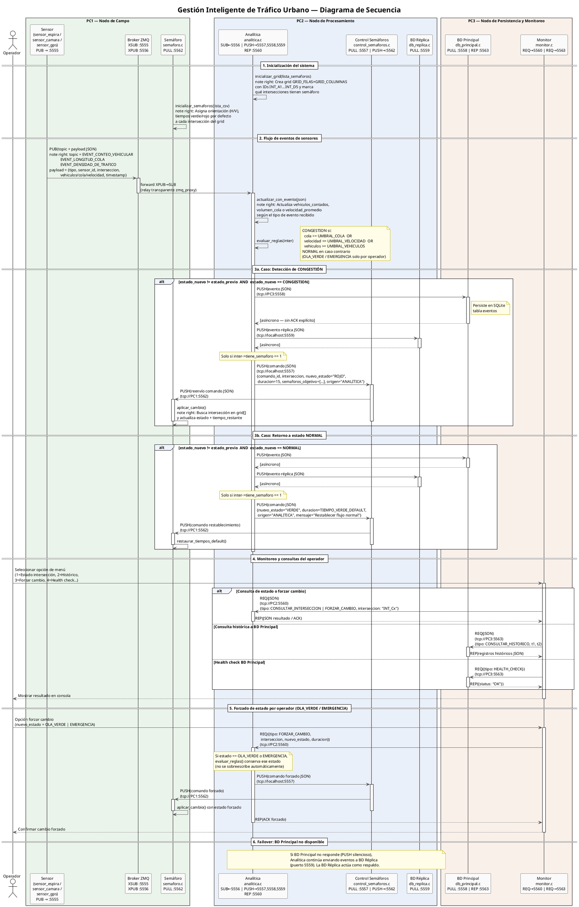

# Diagrama de Secuencia — Gestión Inteligente de Tráfico Urbano

```plantuml
@startuml diagrama_secuencia
!theme plain
skinparam defaultFontSize 12
skinparam responseMessageBelowArrow true
skinparam ArrowColor #555555
skinparam ParticipantBackgroundColor #FAFAFA
skinparam ParticipantBorderColor #888888
skinparam SequenceGroupBackgroundColor #F0F4FF
skinparam NoteBackgroundColor #FFFDE7
skinparam NoteBorderColor #CCBB00

title Gestión Inteligente de Tráfico Urbano — Diagrama de Secuencia

actor "Operador" as User

box "PC1 — Nodo de Campo" #EAF4EA
  participant "Sensor\n(sensor_espira /\nsensor_camara /\nsensor_gps)\nPUB → :5555" as Sensor
  participant "Broker ZMQ\nXSUB :5555\nXPUB :5556" as Broker
  participant "Semáforo\nsemaforo.c\nPULL :5562" as Semaforo
end box

box "PC2 — Nodo de Procesamiento" #EAF0FA
  participant "Analítica\nanalitica.c\nSUB←5556 | PUSH→5557,5558,5559\nREP :5560" as Analitica
  participant "Control Semáforos\ncontrol_semaforos.c\nPULL :5557 | PUSH→:5562" as CtrlSem
  participant "BD Réplica\ndb_replica.c\nPULL :5559" as BD_Replica
end box

box "PC3 — Nodo de Persistencia y Monitoreo" #FAF0EA
  participant "BD Principal\ndb_principal.c\nPULL :5558 | REP :5563" as BD_Principal
  participant "Monitor\nmonitor.c\nREQ→5560 | REQ→5563" as Monitor
end box

== 1. Inicialización del sistema ==

Analitica -> Analitica: inicializar_grid(lista_semaforos)\nnote right: Crea grid GRID_FILAS×GRID_COLUMNAS\ncon IDs INT_A1…INT_D5 y marca\nqué intersecciones tienen semáforo

Semaforo -> Semaforo: inicializar_semaforos(lista_csv)\nnote right: Asigna orientación (H/V),\ntiempos verde/rojo por defecto\na cada intersección del grid

== 2. Flujo de eventos de sensores ==

Sensor -> Broker: PUB(topic + payload JSON)\nnote right: topic = EVENT_CONTEO_VEHICULAR\n           EVENT_LONGITUD_COLA\n           EVENT_DENSIDAD_DE_TRAFICO\npayload = {tipo, sensor_id, interseccion,\n           vehiculos/cola/velocidad, timestamp}

activate Broker
Broker -> Analitica: forward XPUB→SUB\n(relay transparente zmq_proxy)
deactivate Broker

activate Analitica
Analitica -> Analitica: actualizar_con_evento(json)\nnote right: Actualiza vehiculos_contados,\nvolumen_cola o velocidad_promedio\nsegún el tipo de evento recibido

Analitica -> Analitica: evaluar_reglas(inter)
note right: CONGESTION si:\n  cola >= UMBRAL_COLA  OR\n  velocidad <= UMBRAL_VELOCIDAD  OR\n  vehiculos >= UMBRAL_VEHICULOS\nNORMAL en caso contrario\n(OLA_VERDE / EMERGENCIA solo por operador)

== 3a. Caso: Detección de CONGESTIÓN ==

alt estado_nuevo != estado_previo  AND  estado_nuevo == CONGESTION

  Analitica -> BD_Principal: PUSH(evento JSON)\n(tcp://PC3:5558)
  activate BD_Principal
  note right of BD_Principal: Persiste en SQLite\ntabla eventos
  BD_Principal --> Analitica: [asíncrono — sin ACK explícito]
  deactivate BD_Principal

  Analitica -> BD_Replica: PUSH(evento réplica JSON)\n(tcp://localhost:5559)
  activate BD_Replica
  BD_Replica --> Analitica: [asíncrono]
  deactivate BD_Replica

  note over Analitica: Solo si inter->tiene_semaforo == 1

  Analitica -> CtrlSem: PUSH(comando JSON)\n(tcp://localhost:5557)\n{comando_id, interseccion, nuevo_estado="ROJO",\n duracion=15, semaforos_objetivo=[...], origen="ANALITICA"}
  activate CtrlSem

  CtrlSem -> Semaforo: PUSH(reenvío comando JSON)\n(tcp://PC1:5562)
  activate Semaforo
  Semaforo -> Semaforo: aplicar_cambio()\nnote right: Busca intersección en grid[]\ny actualiza estado + tiempo_restante
  deactivate Semaforo

  deactivate CtrlSem

end

== 3b. Caso: Retorno a estado NORMAL ==

alt estado_nuevo != estado_previo  AND  estado_nuevo == NORMAL

  Analitica -> BD_Principal: PUSH(evento JSON)
  activate BD_Principal
  BD_Principal --> Analitica: [asíncrono]
  deactivate BD_Principal

  Analitica -> BD_Replica: PUSH(evento réplica JSON)
  activate BD_Replica
  BD_Replica --> Analitica: [asíncrono]
  deactivate BD_Replica

  note over Analitica: Solo si inter->tiene_semaforo == 1

  Analitica -> CtrlSem: PUSH(comando JSON)\n{nuevo_estado="VERDE", duracion=TIEMPO_VERDE_DEFAULT,\n origen="ANALITICA", mensaje="Restablecer flujo normal"}
  activate CtrlSem

  CtrlSem -> Semaforo: PUSH(comando restablecimiento)\n(tcp://PC1:5562)
  activate Semaforo
  Semaforo -> Semaforo: restaurar_tiempos_default()
  deactivate Semaforo

  deactivate CtrlSem

end

deactivate Analitica

== 4. Monitoreo y consultas del operador ==

User -> Monitor: Seleccionar opción de menú\n(1=Estado intersección, 2=Histórico,\n3=Forzar cambio, 4=Health check…)
activate Monitor

alt Consulta de estado o forzar cambio

  Monitor -> Analitica: REQ(JSON)\n(tcp://PC2:5560)\n{tipo: CONSULTAR_INTERSECCION | FORZAR_CAMBIO, interseccion: "INT_Cx"}
  activate Analitica
  Analitica --> Monitor: REP(JSON resultado / ACK)
  deactivate Analitica

else Consulta histórica a BD Principal

  Monitor -> BD_Principal: REQ(JSON)\n(tcp://PC3:5563)\n{tipo: CONSULTAR_HISTORICO, t1, t2}
  activate BD_Principal
  BD_Principal --> Monitor: REP(registros históricos JSON)
  deactivate BD_Principal

else Health check BD Principal

  Monitor -> BD_Principal: REQ({tipo: HEALTH_CHECK})\n(tcp://PC3:5563)
  activate BD_Principal
  BD_Principal --> Monitor: REP({status: "OK"})
  deactivate BD_Principal

end

Monitor --> User: Mostrar resultado en consola
deactivate Monitor

== 5. Forzado de estado por operador (OLA_VERDE / EMERGENCIA) ==

User -> Monitor: Opción forzar cambio\n(nuevo_estado = OLA_VERDE | EMERGENCIA)
activate Monitor

Monitor -> Analitica: REQ({tipo: FORZAR_CAMBIO,\n interseccion, nuevo_estado, duracion})\n(tcp://PC2:5560)
activate Analitica

note over Analitica: Si estado == OLA_VERDE o EMERGENCIA,\nevaluar_reglas() conserva ese estado\n(no se sobreescribe automáticamente)

Analitica -> CtrlSem: PUSH(comando forzado JSON)\n(tcp://localhost:5557)
activate CtrlSem
CtrlSem -> Semaforo: PUSH(comando forzado)\n(tcp://PC1:5562)
activate Semaforo
Semaforo -> Semaforo: aplicar_cambio() con estado forzado
deactivate Semaforo
deactivate CtrlSem

Analitica --> Monitor: REP(ACK forzado)
deactivate Analitica

Monitor --> User: Confirmar cambio forzado
deactivate Monitor

== 6. Failover: BD Principal no disponible ==

note over Analitica, BD_Replica
  Si BD Principal no responde (PUSH silencioso),
  Analítica continúa enviando eventos a BD Réplica
  (puerto 5559). La BD Réplica actúa como respaldo.
end note

@enduml
```